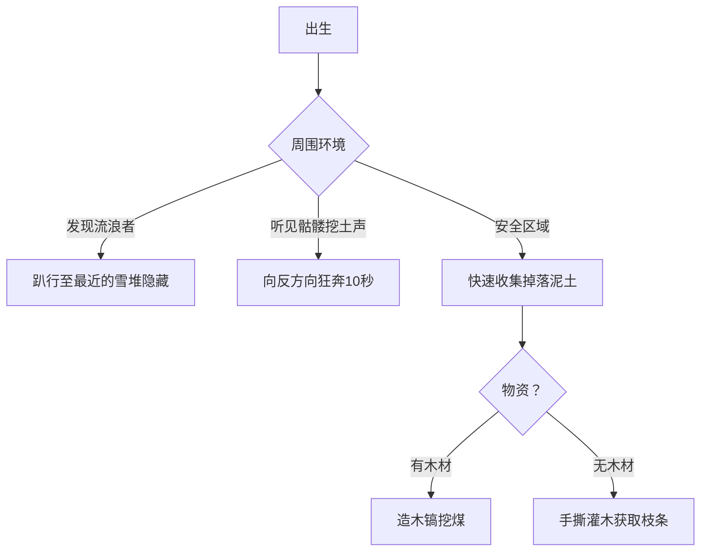

### ❄️ **《FrostCore 终极生存指南 V3.0》**  
**——当脚下的泥土开始背叛你**  

---

### ⚠️ **一、末日新威胁：动态环境系统**  
| **机制**                | 生存影响                  | 反制策略                     |
|------------------------|-------------------------|----------------------------|
| **泥土可掉落**          | 挖洞避难可能引发坍塌      | ▶ 垂直挖掘必用**木板支撑**  |
| **怪物可挖泥土**        | 骷髅能从地面挖进基地      | ▶ 基地外墙需覆盖**圆石层**  |
| **随机出生点**          | 可能直接刷在流浪者脸上    | ▶ 开局立刻趴下+观察环境     |  

> 💀 **死亡案例**：  
> - 玩家A挖矿时头顶泥土掉落→窒息而亡  
> - 玩家B的土墙基地被骷髅挖穿→全员冻死  

---

### 🏔️ **二、四阶段生存路线（新增地形策略）**  
| **阶段**         | **地形危机**              | **基地建设法则**              |
|------------------|-------------------------|-----------------------------|
| **挣扎求生**     | 随机出生点附近无木材     | 优先收集**掉落泥土**造临时墙 |
| **稳定发展**     | 油田争夺战引发**地陷**   | 用原油浇灌地面固化作战区域  |
| **科技复兴**     | 地心副本入口**周期性塌方**| 力场塔必须覆盖**头顶基岩层** |
| **联盟争霸**     | 敌对联盟挖地道突袭       | 基地外围埋**感应式热能地雷** |  

---

### 🗺️ **三、随机开局决策树**  


---

### ⚔️ **四、怪物行为升级应对**  
**流浪者 & 骷髅新增能力**：  
- 用弓箭射落玩家头顶的泥土→制造塌方  
- 挖掘**3秒**可破坏泥土墙（圆石需15秒）  
- 优先攻击**未覆盖圆石**的熔炉/核心  

**防御方案**：  
```python
def 基地防御等级(外墙材料):
    if 材料 == "泥土":
        return "E级（骷髅30秒攻破）"
    elif 材料 == "圆石":
        return "B级（需科技升级）"
    elif 材料 == "力场塔防护":
        return "S级（免疫挖掘）"
```

---

### 💀 **五、硬核数据补完**  
| **新增机制**       | 数值/效果                 | 致死场景                  |
|-------------------|-------------------------|-------------------------|
| **泥土掉落概率**  | 悬空时**100%瞬间掉落**   | 垂直矿洞无支撑=活埋      |
| **怪物挖掘速度**  | 骷髅：**3秒/格**         | 土墙基地≈纸糊防御        |
| **健康值系统**    | 冻伤：-1点/10秒          | 叠加饱食度归零=器官衰竭  |  

---

### ⛏️ **六、核心物品生存公式**  
**热能核心防冻服续航公式**：  
```
安全时长 = (煤炭储备 × 核心效率) ÷ (人数 × 0.05) 
```
> **示例**：  
> - 3人团队 + 进阶核心 + 20煤炭  
> - `(20×1) ÷ (3×0.05) = 133分钟`  
> 👉 遭遇极寒时刻需额外储备**50%**  

---

### 🔥 **七、高频生存问答（新增）**  
**Q：被随机出生在冰原怎么办？**  
→ A：用手挖雪块造**紧急雪洞**（需5秒内完成），等待流浪者离开  

**Q：骷髅开始挖基地墙壁如何反击？**  
→ A：  
1. 浇**岩浆**固化墙面（消耗1桶原油）  
2. 用**木棍击晕队友**扔向骷髅转移仇恨  

**Q：健康值归零会怎样？**  
→ A：进入**永久残疾状态**（移动-50%），需聚变塔科技修复  

> **记住：圆石是比钻石更珍贵的货币，信任是比极寒更冷的刀刃**  
> **——地心勘探队第17号遗言**  
